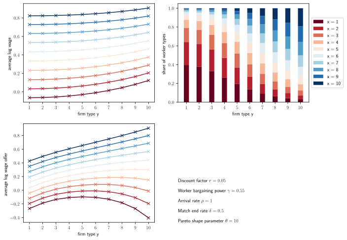
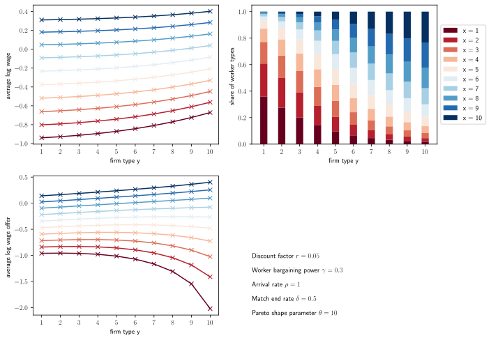
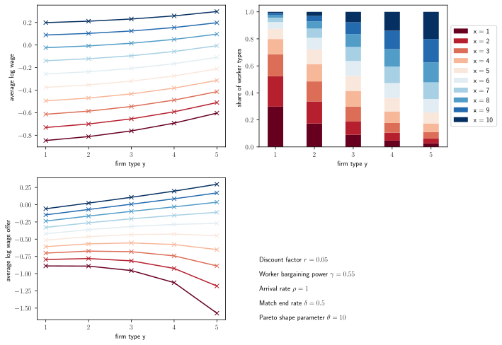

# macro-replications

Replications of macroeconomic papers using Python and MATLAB.

Each folder, named after a paper's authors and year of publication, contains a `.py`, `.m`, or `.mod` file generating its data and graphs. For workering papers, it is the year of replication. The folder should also contain a pdf document summarizing the essential parameters, equations and findings of the model as of the time of replication.


## Borovičková, Shimer (2024)

- All relevant files are under the `Borovičková-Shimer-2024` folder.

- `selction.py`: Run `python3 selection.py` in terminal to replicate "Assortative Matching and Wages: The Role of Selection" (Borovičková & Shimer working paper):



To modify paramters, input new values as keyword arguments. Here is a case where we choose a lower $\gamma$, the worker's bargaining power, than the paper such that the average log wage becomes lower.

```python
import selection
market = selection.LaborMarket(gamma=0.3)
market.replicate('lower_bargaining_power.svg')
```



The code also accounts for the changes in the numbers of workers firms so long as the number of workers and firms are consistent. Here is a case where we have fewer firm types than worker types, and the firm contributes more to disparaity in match output $f_{xy}$.

```python
import selection
import numpy as np
dist_X = np.full((10), 0.1)
dist_Y = np.full((5), 0.2)
prod_mat = np.array(list([np.sqrt((1.1**x)*(2.**y)) for y in range(5)]
    for x in range(10)))
market = selection.LaborMarket(prod_mat = prod_mat, dist_X = dist_X, dist_Y = dist_Y)
market.replicate('fewer_firms.svg')
```



- Package requirements can be found in the `requirements.txt` file.


